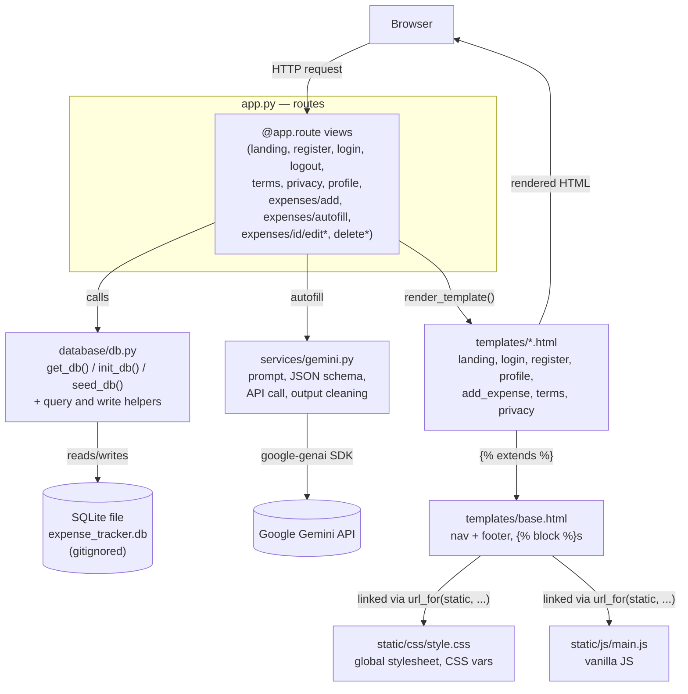

# CLAUDE.md

This file provides guidance to Claude Code (claude.ai/code) when working with code in this repository.

## Project

Spendly — a personal expense tracker built with Flask, developed incrementally as a step-by-step
learning project. Many routes and modules are intentionally left as stubs to be implemented in
later steps; don't assume missing functionality is a bug unless asked to implement that step.

Note: the git repo root is this directory (`expense-tracker/expense-tracker` relative to the
outer folder it was unzipped into). The outer parent directory is not part of the project — it
only exists because this folder was extracted from a zip. Always start Claude Code (and run
git) from this inner directory — the slash commands in `.claude/commands/` use paths relative to
it (`database/db.py`, `.claude/specs/`), and git commands fail outright from the outer folder.

## Commands

```bash
# create/activate the virtualenv (already present as venv/)
source venv/bin/activate

# install dependencies
pip install -r requirements.txt

# optional: turn on Gemini autofill by putting GEMINI_API_KEY in .env (gitignored)
cp .env.example .env

# run the dev server (http://localhost:5001)
python app.py

# run tests (they never call the real Gemini API — see "AI autofill" below)
pytest
```

There is no build step, linter, or frontend toolchain — templates and static assets are served
directly by Flask.

## Architecture — where things belong



`*` = placeholder route, not yet implemented (see the roadmap table below).

- `app.py` — the only Flask app instance and every route. There is no blueprint structure yet, so
  new routes are added directly here, grouped under the existing `# Routes` /
  `# Placeholder routes` banner comments. Keep view functions thin: parse request → call a
  `database/db.py` helper (or a `services/` module for external APIs) → render a template.
- `database/db.py` — the one place SQL/connection logic should live. It holds `get_db()` (SQLite
  connection with `row_factory` and foreign keys enabled), `init_db()` (creates tables with
  `CREATE TABLE IF NOT EXISTS`), `seed_db()` (sample data for development), and the query/write
  helpers. Routes should call into this module rather than opening `sqlite3` connections themselves.
- `services/gemini.py` — the only module that talks to Google Gemini: the prompt, the JSON schema,
  the API call with its timeout and error mapping, and `normalize_expense()`, which cleans the
  model's reply. It raises `AutofillError` with messages that are safe to show on the page. It never
  touches the database or Flask.
- `templates/base.html` — the shared page chrome (nav + footer) that every other template extends
  via Jinja ``s (`title`, `head`, `content`, `scripts`). Page-specific markup goes in
  its own template file, not in `base.html`.
- `templates/*.html` (`landing.html`, `login.html`, `register.html`, `profile.html`,
  `add_expense.html`, `terms.html`, `privacy.html`) — one template per route, each
  `` and fills the `content` block.
- `static/css/style.css` — the single global stylesheet for the whole site. New styles belong here
  (in the relevant commented section), not inline in templates and not in a new per-page CSS file.
- `static/js/main.js` — the one place for client-side JS. It currently holds the AI autofill
  behaviour (shrinking large receipt photos before upload, busy buttons, sending the browser's local
  date). Add interactions here as vanilla JS, not inline `<script>` blocks in templates (the
  youtube-modal work is the one existing precedent, added inline in `landing.html` — new JS should
  still prefer `main.js` unless a task says otherwise).

## Code style

- Python: one small view function per route, named after what it does (`landing`, `register`,
  `add_expense`, ...), decorated with `@app.route(...)`. No classes, no docstrings on routes —
  the route path plus function name is the documentation. Section banners look like:
  ```python
  # ------------------------------------------------------------------ #
  # Routes                                                              #
  # ------------------------------------------------------------------ #
  ```
- Templates: `` then ``/``. Class
  names are kebab-case and loosely BEM-style scoped to a section (`auth-section`,
  `auth-container`, `auth-header`, `auth-title`, `form-group`, `form-input`, `btn-submit`). Forms
  use hardcoded `action="/login"`-style paths (not `url_for`) — match the existing pattern rather
  than "fixing" it unless asked. Example placeholder text uses a consistent fictitious persona
  ("Nitish Kumar" / "nitish@example.com") — reuse it rather than inventing a new one.
- CSS: one stylesheet, organized into `/* ---- Section ---- */`-style comment banners (variables,
  reset, navbar, hero, footer, auth, ...). All colors/spacing/radii/fonts are CSS custom
  properties defined once in `:root` (`--ink`, `--paper`, `--accent`, `--radius-md`, ...) — reuse
  an existing variable instead of hardcoding a new color or size.
- JS: vanilla only, no libraries, no bundler.
- Commit messages follow `<area>: <short imperative description>` (e.g. `landing: add terms and
  conditions page and route`).
- When a task says to modify only one section/page, don't touch unrelated markup, routes, or
  styles even if they look related.

## Tech constraints

- Python 3.12, Flask 3.1.3, Werkzeug 3.1.6, google-genai 2.23.0, python-dotenv 1.2.3 (see
  `requirements.txt`) — don't add new dependencies without a reason tied to the task.
- Storage is SQLite via the stdlib `sqlite3` module (per the `database/db.py` stub) — no ORM
  (SQLAlchemy, etc.) and no external database.
- No frontend framework or build tooling — no npm, no bundler, no JSX/TSX. Plain Jinja templates,
  one CSS file, one JS file.
- No auth/session system exists yet — `login.html`/`register.html` POST to `/login`/`/register`,
  but `app.py` only defines `GET` handlers for those paths today, and the templates already
  reference an `` block that nothing currently populates. Implementing `POST`
  handling, password hashing, and session cookies is future-step work, not a bug to silently fix.
- Everything runs through Flask's built-in dev server (`app.run(debug=True, port=5001)`) — no
  WSGI/production server config exists.
- The app is also deployed to Vercel (zero-config Flask, entrypoint `app.py`, no `vercel.json`).
  There the filesystem is read-only except `/tmp`, so the SQLite database is ephemeral and
  per-instance: registered users and their data vanish on cold starts and redeploys, and only the
  seeded demo account is guaranteed. `SECRET_KEY` and `GEMINI_API_KEY` come from the Vercel
  project's environment variables. Vercel rejects request bodies over 4.5 MB, which is why receipt
  uploads are capped at 4 MB and shrunk in the browser. See `.claude/specs/fix-vercel-deployment.md`.

## AI autofill (Gemini)

Spec: `.claude/specs/ai-expense-autofill.md`. The add-expense page can be filled in from a receipt
photo or a plain-English note via `POST /expenses/autofill`.

- Gemini's reply only pre-fills the form. It is never passed to `create_expense()`; the user
  submits the form, and `parse_expense_form()` validates it like any other input.
- `GEMINI_API_KEY` (and optional `GEMINI_MODEL`, default `gemini-3.5-flash-lite`) are read from the
  environment at request time. Locally `load_dotenv()` in `app.py` loads them from the gitignored
  `.env` (template: `.env.example`), and the dev server has to be restarted after editing `.env`.
  With no key, `gemini.is_enabled()` is false, the panel is hidden, and the app behaves as it did
  after Step 7.
- Limits: `DAILY_LIMIT` (30) per user per UTC day, counted in `ai_requests`; `MAX_RECEIPT_MB` (4)
  via `MAX_CONTENT_LENGTH` (a 413 handler re-renders the form with a message); a 300-character note;
  and a 20 s timeout.
- Tests must never reach the network. The autouse `no_real_gemini` fixture in `conftest.py` blanks
  the key and replaces `gemini._generate` with a stub that fails the test. Use the `fake_gemini`
  fixture in `tests/test_autofill.py`, which sets a test key and returns canned replies. Tests of the
  request itself patch `gemini.genai.Client` instead.

## Implemented vs. stub routes (roadmap)

Implemented:

| Route | Methods | Notes |
|---|---|---|
| `/` | GET | landing page |
| `/terms`, `/privacy` | GET | static legal pages |
| `/register` | GET, POST | Step 2 — validates input, hashes password, creates the user |
| `/login` | GET, POST | Step 3 — verifies the password hash, sets `session["user_id"]` and `session["user_email"]`; signed-in checks go through `get_current_user()`, which clears stale sessions |
| `/logout` | GET | Step 3 — clears the session |
| `/profile` | GET | Steps 4–6 — signed-in only; user card, stats, every transaction and category totals queried from `expenses`, narrowed by optional `?start_date=` / `?end_date=` (Step 6 date filter, validated by `parse_date_range()`); "Add expense" button, plus an "Expense added." notice on `?added=1` (Step 7) |
| `/expenses/add` | GET, POST | Step 7 — signed-in only; `parse_expense_form()` validates, `create_expense()` inserts for the session user, redirects to `/profile?added=1`; renders through `render_expense_form()`, which shows the Gemini autofill panel when a key is set |
| `/expenses/autofill` | POST | AI autofill (off-roadmap, see above) — signed-in only; `parse_autofill_form()` checks the receipt or note, then `services/gemini.py` extracts the expense and the add-expense form is re-rendered pre-filled; never inserts an expense |

Stub (return a plain string, tagged with the step that's meant to implement them):

| Route | Step | Notes |
|---|---|---|
| `/expenses/<int:id>/edit` | Step 8 | |
| `/expenses/<int:id>/delete` | Step 9 | |

`database/db.py` (Step 1 — Database Setup) is implemented: `get_db()`, `init_db()`, `seed_db()`,
plus `create_user()` / `get_user_by_email()` / `get_user_by_id()`, and the Step 5 profile queries
`get_expense_stats()` / `get_category_totals()` / `get_expenses_by_user()`, which all take optional
inclusive `start_date` / `end_date` ISO-string bounds (Step 6, built by `_date_range_clause()`). The
`users`, `expenses` and `ai_requests` tables exist, and `app.py` calls `init_db()` / `seed_db()` at
import time. The SQLite file is `expense_tracker.db` in the project root locally, or
`/tmp/expense_tracker.db` when the `VERCEL` env var is set (chosen by `_default_db_path()`). Step 7
added the first write helper, `create_expense()`; AI autofill added `count_ai_requests_today()` /
`log_ai_request()` for its daily limit; the edit/delete routes (Steps 8–9) still need their own
update/delete helpers added to this module.

Step 6 is the profile date filter (`.claude/specs/06-date-filter.md`). When asked to implement a
stub route, do only that step: match the pattern of the already-implemented routes (call into
`database/db.py`, render a template), and don't jump ahead to later steps.
