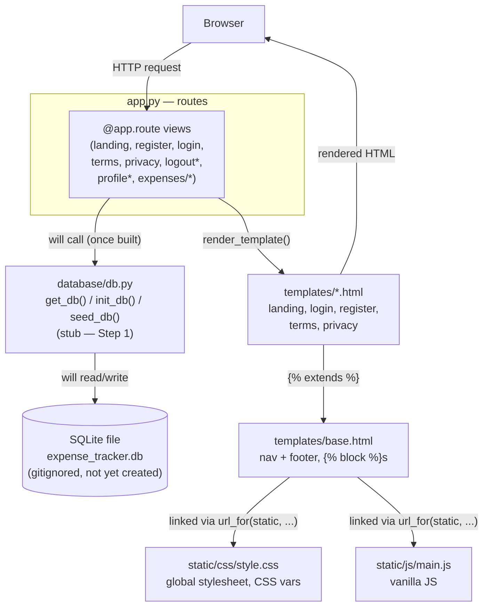

# CLAUDE.md

This file provides guidance to Claude Code (claude.ai/code) when working with code in this repository.

## Project

Spendly — a personal expense tracker built with Flask, developed incrementally as a step-by-step
learning project. Many routes and modules are intentionally left as stubs to be implemented in
later steps; don't assume missing functionality is a bug unless asked to implement that step.

Note: the git repo root is this directory (`expense-tracker/expense-tracker` relative to the
outer folder it was unzipped into). The outer parent directory is not part of the project — it
only exists because this folder was extracted from a zip. Always start Claude Code (and run
git) from this inner directory — the slash commands in `.claude/commands/` use paths relative to
it (`database/db.py`, `.claude/specs/`), and git commands fail outright from the outer folder.

## Commands

```bash
# create/activate the virtualenv (already present as venv/)
source venv/bin/activate

# install dependencies
pip install -r requirements.txt

# run the dev server (http://localhost:5001)
python app.py

# run tests (pytest + pytest-flask are declared dependencies; no tests exist yet)
pytest
```

There is no build step, linter, or frontend toolchain — templates and static assets are served
directly by Flask.

## Architecture — where things belong



`*` = placeholder route, not yet implemented (see the roadmap table below).

- `app.py` — the only Flask app instance and every route. There is no blueprint structure yet, so
  new routes are added directly here, grouped under the existing `# Routes` /
  `# Placeholder routes` banner comments. Keep view functions thin: parse request → call a
  `database/db.py` helper → render a template.
- `database/db.py` — the one place SQL/connection logic should live. It is currently a stub
  described only in comments; it is meant to hold `get_db()` (SQLite connection with
  `row_factory` and foreign keys enabled), `init_db()` (creates tables with
  `CREATE TABLE IF NOT EXISTS`), and `seed_db()` (sample data for development). Routes should call
  into this module rather than opening `sqlite3` connections themselves.
- `templates/base.html` — the shared page chrome (nav + footer) that every other template extends
  via Jinja ``s (`title`, `head`, `content`, `scripts`). Page-specific markup goes in
  its own template file, not in `base.html`.
- `templates/*.html` (`landing.html`, `login.html`, `register.html`, `terms.html`, `privacy.html`)
  — one template per route, each `` and fills the `content` block.
- `static/css/style.css` — the single global stylesheet for the whole site. New styles belong here
  (in the relevant commented section), not inline in templates and not in a new per-page CSS file.
- `static/js/main.js` — the one place for client-side JS. Currently an empty placeholder; add
  interactions here as vanilla JS, not inline `<script>` blocks in templates (the youtube-modal
  work is the one existing precedent, added inline in `landing.html` — new JS should still prefer
  `main.js` unless a task says otherwise).

## Code style

- Python: one small view function per route, named after what it does (`landing`, `register`,
  `add_expense`, ...), decorated with `@app.route(...)`. No classes, no docstrings on routes —
  the route path plus function name is the documentation. Section banners look like:
  ```python
  # ------------------------------------------------------------------ #
  # Routes                                                              #
  # ------------------------------------------------------------------ #
  ```
- Templates: `` then ``/``. Class
  names are kebab-case and loosely BEM-style scoped to a section (`auth-section`,
  `auth-container`, `auth-header`, `auth-title`, `form-group`, `form-input`, `btn-submit`). Forms
  use hardcoded `action="/login"`-style paths (not `url_for`) — match the existing pattern rather
  than "fixing" it unless asked. Example placeholder text uses a consistent fictitious persona
  ("Nitish Kumar" / "nitish@example.com") — reuse it rather than inventing a new one.
- CSS: one stylesheet, organized into `/* ---- Section ---- */`-style comment banners (variables,
  reset, navbar, hero, footer, auth, ...). All colors/spacing/radii/fonts are CSS custom
  properties defined once in `:root` (`--ink`, `--paper`, `--accent`, `--radius-md`, ...) — reuse
  an existing variable instead of hardcoding a new color or size.
- JS: vanilla only, no libraries, no bundler.
- Commit messages follow `<area>: <short imperative description>` (e.g. `landing: add terms and
  conditions page and route`).
- When a task says to modify only one section/page, don't touch unrelated markup, routes, or
  styles even if they look related.

## Tech constraints

- Python 3.12, Flask 3.1.3, Werkzeug 3.1.6 (see `requirements.txt`) — don't add new dependencies
  without a reason tied to the task.
- Storage is SQLite via the stdlib `sqlite3` module (per the `database/db.py` stub) — no ORM
  (SQLAlchemy, etc.) and no external database.
- No frontend framework or build tooling — no npm, no bundler, no JSX/TSX. Plain Jinja templates,
  one CSS file, one JS file.
- No auth/session system exists yet — `login.html`/`register.html` POST to `/login`/`/register`,
  but `app.py` only defines `GET` handlers for those paths today, and the templates already
  reference an `` block that nothing currently populates. Implementing `POST`
  handling, password hashing, and session cookies is future-step work, not a bug to silently fix.
- Everything runs through Flask's built-in dev server (`app.run(debug=True, port=5001)`) — no
  WSGI/production server config exists.

## Implemented vs. stub routes (roadmap)

Implemented:

| Route | Methods | Notes |
|---|---|---|
| `/` | GET | landing page |
| `/terms`, `/privacy` | GET | static legal pages |
| `/register` | GET, POST | Step 2 — validates input, hashes password, creates the user |
| `/login` | GET, POST | Step 3 — verifies the password hash, sets `session["user_id"]` |
| `/logout` | GET | Step 3 — clears the session |
| `/profile` | GET | Steps 4–5 — signed-in only; user card, stats, recent transactions and category totals queried from `expenses` |

Stub (return a plain string, tagged with the step that's meant to implement them):

| Route | Step | Notes |
|---|---|---|
| `/expenses/add` | Step 7 | |
| `/expenses/<int:id>/edit` | Step 8 | |
| `/expenses/<int:id>/delete` | Step 9 | |

`database/db.py` (Step 1 — Database Setup) is implemented: `get_db()`, `init_db()`, `seed_db()`,
plus `create_user()` / `get_user_by_email()` / `get_user_by_id()`, and the Step 5 profile queries
`get_expense_stats()` / `get_category_totals()` / `get_expenses_by_user()`. The `users` and
`expenses` tables exist, and `app.py` calls `init_db()` / `seed_db()` at import time. The expense
routes above still need their own write helpers (insert/update/delete) added to this module.

Step 6 isn't named anywhere in the code — don't guess what it is; ask or wait for an explicit task
before inventing routes/features to fill that gap. When asked to implement a
stub route, do only that step: match the pattern of the already-implemented routes (call into
`database/db.py`, render a template), and don't jump ahead to later steps.
