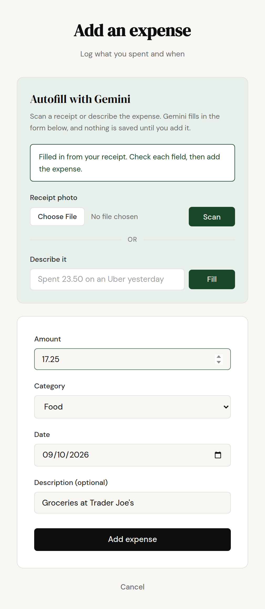
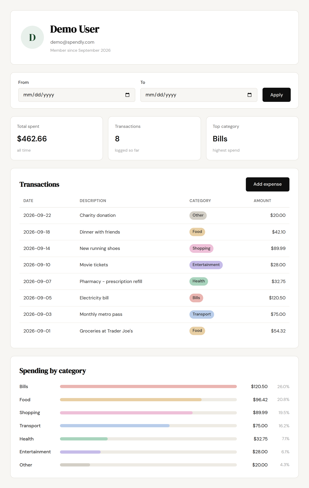
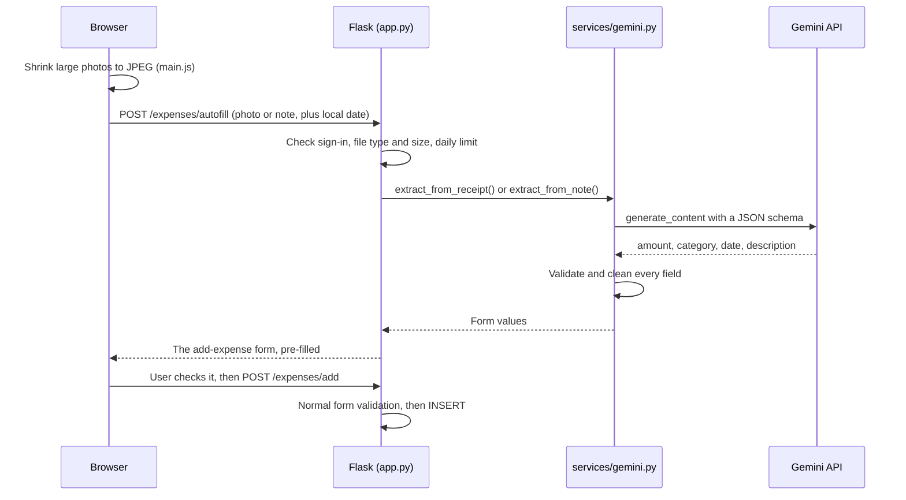

# Spendly

A personal expense tracker built with Flask and SQLite, with **Google Gemini autofill**. Take a photo
of a receipt, or type "spent 23.50 on an Uber yesterday", and the expense form fills itself in for
you to check and save.

**Live demo:** [spendly-nine-bay.vercel.app](https://spendly-nine-bay.vercel.app). Sign in with
`demo@spendly.com` / `demo123`.



*A real Gemini result from scanning a sample grocery receipt. The user checks the values, then adds
the expense.*

## Features

- **Accounts:** register, sign in and sign out. Passwords are hashed with Werkzeug, and sessions use
  signed cookies.
- **Spending dashboard:** total spent, number of transactions, top category, every transaction, and
  spending by category, all filterable by date range.
- **Add expenses:** a form with full server-side validation.
- **AI autofill with Gemini:**
  - **Receipt scanning.** Upload a photo and Gemini reads the total, date, merchant and category.
  - **Quick add.** Describe an expense in plain English. Words like "yesterday" are worked out from
    your local date, not the server's.



## How AI autofill works



### Design decisions

- **The model never writes to the database.** Gemini's answer only pre-fills the form. The user
  checks it and submits it, and it goes through the same `parse_expense_form()` validation as an
  expense typed by hand.
- **Structured output that still isn't trusted.** The request uses a JSON schema that limits
  `category` to the app's categories. The server still checks every field of the reply: the amount
  must be a finite number between 0 and 1,000,000, the date must be a real `YYYY-MM-DD` date, and the
  description is trimmed. Anything unusable is left blank for the user instead of guessed.
- **Prompt injection is contained.** The prompt tells Gemini to treat text on a receipt or in a note
  as data. Even if a malicious receipt ignores that, the model has no tools and its output is plain
  form values that Jinja escapes and the server validates again. The worst it can do is fill in wrong
  values that the user can see before saving.
- **The API key stays on the server.** The browser never talks to Gemini.
- **Limits on cost and abuse.** Each user gets 30 autofills a day, counted in an `ai_requests`
  table. Uploads are capped at 4 MB, and Gemini calls time out after 20 seconds.
- **Big phone photos still work on Vercel.** Vercel rejects request bodies over 4.5 MB, so
  `main.js` shrinks large images to a JPEG of at most 2000px before uploading. A 15 MB image becomes
  about 350 KB.
- **Time zones.** The server runs on UTC, so the browser sends its local date with each request.
  "Yesterday" means the user's yesterday, and a date more than a day off from the server's is ignored.
- **It works without a key.** If `GEMINI_API_KEY` isn't set, the autofill panel is hidden and the rest
  of the app works normally.
- **Tests never call the real API.** A `conftest.py` fixture switches Gemini off for every test and
  makes any real call fail the test. The autofill tests use a fake that returns canned replies, API
  errors and timeouts.

## Tech stack

Python 3.12 · Flask 3.1 · SQLite (stdlib `sqlite3`, no ORM) · Jinja templates · vanilla JavaScript
and CSS · Google Gen AI SDK (`google-genai`) · pytest · Vercel

## Run it locally

```bash
git clone https://github.com/gman215/spendly.git
cd spendly
python3 -m venv venv
source venv/bin/activate
pip install -r requirements.txt
cp .env.example .env   # optional: paste your Gemini API key into .env
python app.py          # http://localhost:5001
```

The database is created and seeded the first time the app starts. Sign in with `demo@spendly.com` /
`demo123`.

You can get a free Gemini API key from [Google AI Studio](https://aistudio.google.com/apikey).
Without one, everything except autofill still works.

### Configuration

| Variable | Needed | What it does |
|---|---|---|
| `GEMINI_API_KEY` | For autofill | Your Gemini API key. Leave it blank to turn autofill off. |
| `GEMINI_MODEL` | No | The Gemini model to use. Defaults to `gemini-3.5-flash-lite`. |
| `SECRET_KEY` | In production | The key used to sign session cookies. |

## Tests

```bash
pytest
```

170 tests cover registration, login, the dashboard and its date filter, adding expenses, the Vercel
setup, and AI autofill. The autofill tests check output cleaning, how the Gemini request is built,
API failures and timeouts, upload validation, daily limits and HTML escaping.

## Project structure

```
app.py                  routes, request parsing and error handlers
database/db.py          SQLite connection, schema and all SQL queries
services/gemini.py      Gemini prompt, JSON schema, API call and output cleaning
templates/              Jinja templates, one per page, all extending base.html
static/css/style.css    the single stylesheet
static/js/main.js       photo shrinking and loading states for autofill
tests/                  pytest suite
.claude/specs/          the spec written before each feature
```

## Deployment

Spendly is deployed on Vercel as a zero-config Flask app. Set `SECRET_KEY` and `GEMINI_API_KEY` in
the Vercel project's environment variables.

Vercel's filesystem is read-only except for `/tmp`, so the SQLite database there is temporary. New
accounts, expenses and daily autofill counts disappear when an instance restarts, and only the seeded
demo account is always available.

## Roadmap

- Edit and delete expenses
- "Ask Spendly": answer questions like "how much did I spend on food last month?" using Gemini
  function calling over read-only database queries
- A persistent hosted database
